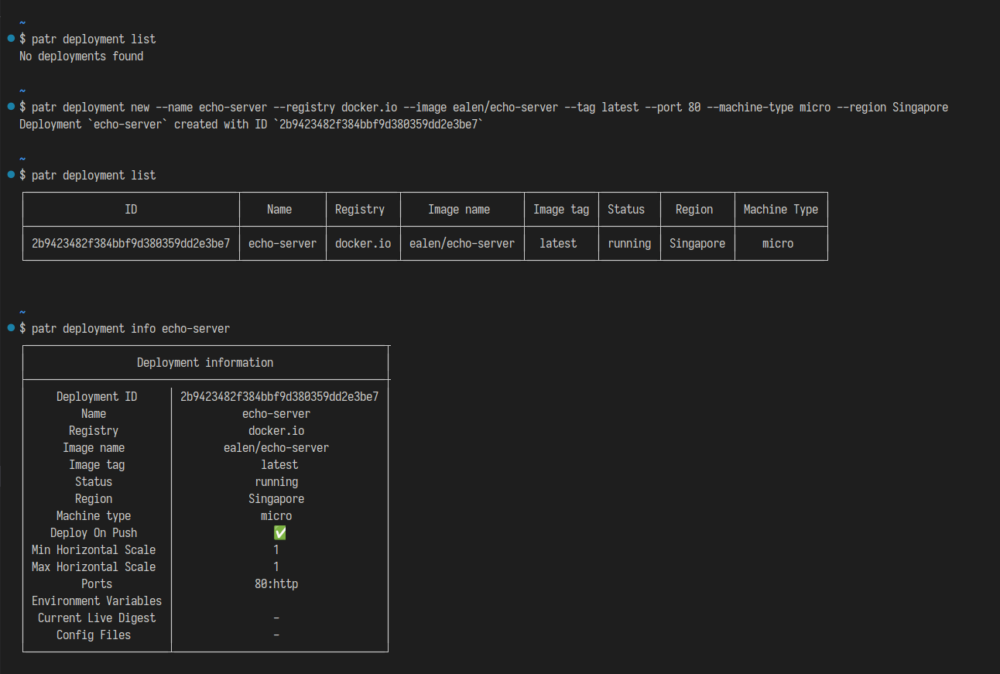

# `patr-cli` - A CLI tool to manage your Patr resources

Patr is a simple to use and easy to scale cloud platform. `patr-cli` is a command line tool designed for folks who want to control and interact with their Patr resources without lifting hands from their keyboard.

## Features:

### Sign-In to Patr account

Sign-In to your Patr account either using username and password or using a separate API token for CLI

### Handle Multiple workspaces

-   List all workspaces associated with the currently logged in user
-   Switch between workspaces to interact with resources in that workspace

### Manage resources

Easily manage and interact with resources like

-   Static Sites
-   Patr registry for docker images
-   Deployments

### Migrate from heroku

Allows you to easily migrate your exiting Heroku resources to Patr in a single command

## Installation:

Patr CLI can be installed using any one of the package manager

-   Linux users can use snap: `snap install patr --channel=beta`
-   Mac users can use brew: `brew install patr-cloud/cli-beta`
-   Windows users can use choco: `choco install patr`
-   If none of the above methods suits your need, you can install binaries directly from [Github release page](https://github.com/patr-cloud/cli/releases)

## Community:

For help, support, or if you just want to hang out with us, you can find us here:

-   [Open issues](https://github.com/patr-cloud/cli/issues) on our github repo if any
-   [Discord](https://patr.cloud/discord) for casual chat
